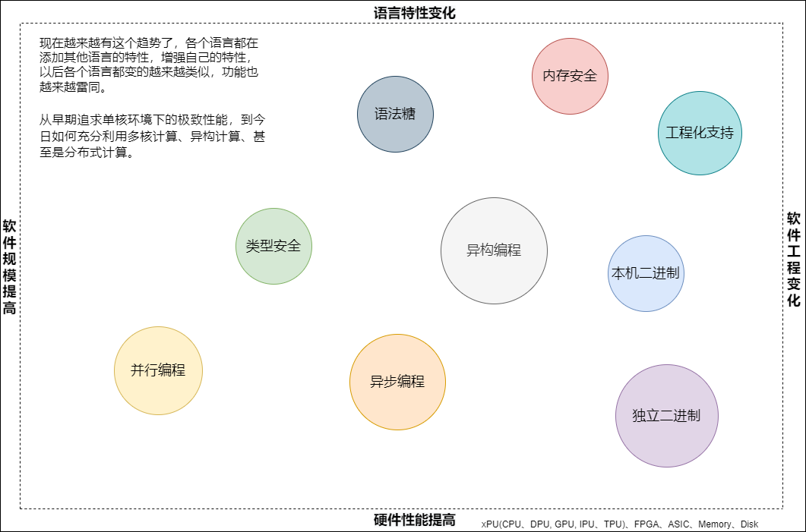
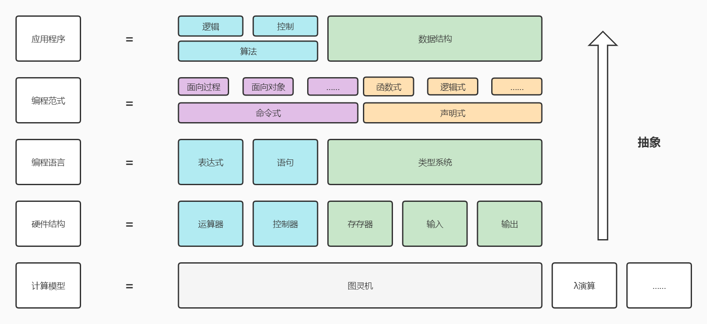
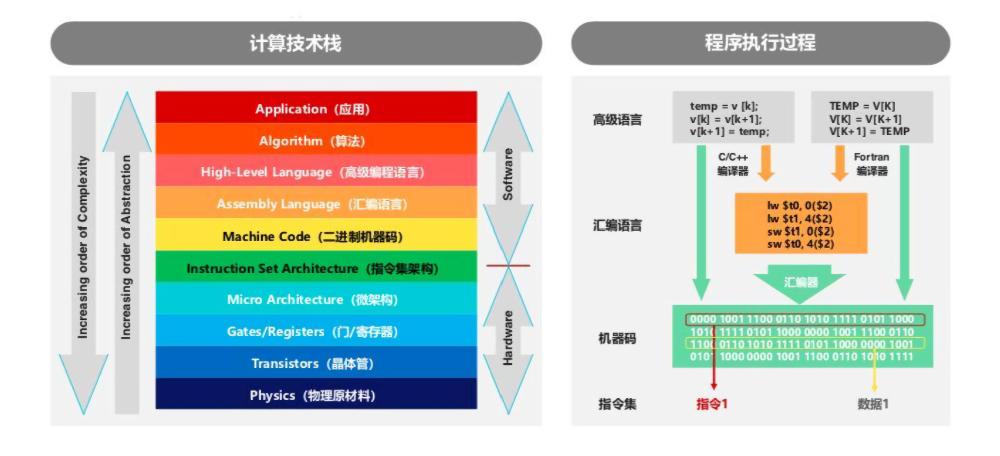

# 语言趋势

- 技术在进步，思想在轮回，感觉编程也像服装、发型一样，潮流几年一轮回
- 编程语言会更加声明式，需要设法引入一些如元编程、函数编程的能力。并且让用户能够扩展语法，使他们可以构造特定领域语言
- 你（coder）简单了，我（compiler）就复杂了
- 算法下沉，从应用下沉到编译器，再到硬件
- 从历史的角度
- 从原语的角度（指令集或者IR）
- 对所有的编程语言，他们的最后的目的其实就是两种：提高硬件的运行效率和提高程序员的开发效率
- 软件基本的抽象:数据的搬移和运算

# 编程思维（编程、做饭、数学、历史）
- [计算思维 （递归、分治、平衡）](http://suquark.github.io/lecture/2016/09/16/computational_thinking.html)
- [数学思维（数据的编码、解码、表示、状态）](http://suquark.github.io/lecture/2017/08/01/cs_from0_state_and_encode.html)[ | 编码理论（编码理论与信息论、数理统计、概率论、随机过程、线性代数、近世代数、数论、有限几何和组合分析等学科有密切关系，已成为应用数学的一个分支。）](https://www.baike.com/wiki/%E7%BC%96%E7%A0%81%E7%90%86%E8%AE%BA/489899?view_id=x3zmbj0kksg00)
- 工程思维
- [计算机思维和数学思维的本质区别](https://developer.aliyun.com/article/988716)
- [计算机边界](https://www.changhai.org/articles/science/mathematics/hilbert10/1.php)
- 道、法、术、器
- 局域性原理（所谓局域性原理，是指的一种时间、空间或者分布上的集中性特征。这是现实中常常会有的情况。之所以称为原理，是因为它不是一种定律，但是却在实际中非常稳定地出现。它告诉了我们 “数学上无解的，现实中总是有解” 的道理）
  + 时空局域性
  + 性能局域性（整体性能往往取决于较小部分，这些部分被称为“瓶颈”）

# 编程词云（第一性原理）
- 迭代器、生成器、装饰器、闭包、概念、合约、协议、模块、组件、包、窄化、类型安全、类型检查、类型推导、资源安全、内存模型、内存安全、契约式编程、防御性编程、过程式编程、函数式编程，面向对象编程，泛型编程、元编程、委托、所有权、异常、契约、闭包
- 确定编程的基本问题，从而分析这些概念是为了解决哪些基本问题
- 编码世界观是重用，方法论是重构
- 学习方式目前主要分为两类，一类是自然主义学习；一类是结构主义学习。自然主义学习是基于模仿，通过向他人学习然后进行自我实践，比如我们学习说话、绘画、溜冰、弹钢琴等；而结构主义学习是系统性的构建并创造新的知识晶体，比如数学、物理、编程。针对学习任务的不同，采用合适的学习方法能让我们学习效率事半功倍。
- 我们重复编码了多年，还是不得要领，就像学习了各种武功，还是无法突破招数的局限一样，这可能就是我们只知道使用技术，而忽略了技术背后真正的核心思想。
- “编程的本质是控制复杂度”，而流程图、过程化、结构化、面向对象以及其它方法论恰好“成功”将复杂度提升到人脑不能处理的地步。
- 宁花机器一分，不花程序员一秒
- 数论 研究一个一个的数特性；Object常用术语: 1, 2, 3, "hello world" 代数 研究数上面的操作的特性；常用术语：+ ，-， * ， /, mod, concat, 群论 把代数上面的操作，根据共通的特性，分成一个组（群）一个组（群）的来研究。Semigroup半群，Monoid幺半群，Group群，Lattice格，Bool布尔代数。半群研究组合性；幺半群研究组合中的特殊值，群主要研究对称性。范畴论把很多代数群一起来研究，看看有各个代数群之间有什么共通的特性。常用术语Functor, Bifunctor, Profunctor, Monad, Comonad, Bimonad, MonoidK, SemigroupK。
- 过程式语言和面向对象语言分别对应着数学思想中的分析思想和代数思想。
- 多态是一个选择问题，因而与其它选择形式，比如if-else，switch-case，模式匹配等，可以等价转换。模版也是一种参数化多态。运行时多态解决的是算法变化问题；而参数化多态解决的是类型变化问题。FP以参数化多态，以及朴素的运行时多态为基础，构成了FP自底向上的组合设计方法：通过将一个个可以适应类型变化的小函数逐级组合，最后得到更为强大的计算功能。
- 驱动编程范式产生巨大变革的力量之一是多核革命。主流的编程范式——面向对象编程已经难以胜任并发与并行计算领域，它只会造成危险且充满 bug 的设计。
- 副作用本身并不坏，但是将它们塞到一个大尺度视图中，我们很难再看清它们，它们便脱离了我们的掌控。完全与副作用打交道的命令式编程范式才是元凶。
- 硬件的变化与软件复杂度的增长都在迫使我们重新思考编程的根本思想。
- 层次化分解与重新复合的过程，并非是受计算机的限制而产生，它反映的是人类思维的局限性。我们的大脑一次只能处理很少的概念。生物学中被广为引用的一篇论文指出我们我们的大脑中只能保存 7± 2 个信息块。我们对人类短期记忆的认识可能会有变化，但是可以肯定的是它是有限的。底线就是我们不能处理一大堆乱糟糟的对象或像兰州拉面似的代码。我们需要结构化并非是因为结构化的程序看上去有多么美好，而是我们的大脑无法有效的处理非结构化的东西。我们经常说一些代码片段是优雅的或美观的，实际上那只意味着它们更容易被人类有限的思维所处理。优雅的代码创造出尺度合理的代码块，它正好与我们的『心智消化系统』能够吸收的数量相符。
- 编程语言的各个方面在这门语言诞生之初是通过形式化标记描述的。但是语言的语义却很难描述，有时用一本挺厚的书来描述，可能也无法完整的说清楚。
- 指令集架构（英语：Instruction Set Architecture，缩写为ISA），又称指令集或指令集体系，是计算机体系结构中与程序设计有关的部分，包含了基本数据类型，指令集，寄存器，寻址模式，存储体系，中断，异常处理以及外部I/O
- 具体(问题)到抽象(程序)、重复到重用、协作到架构、化繁为简、分而治之、大道至简、重构、熵减
- 从具体到抽象可以看做是从基本事件，达到理论推理的高度；而从抽象到具体，则是将理论运用到实践解决实际问题的过程。他们可以说是一体两面的东西。
- 无论微观世界的代码，还是宏观层面的架构，无论是三种编程范式还是微服务架构，它们都在解决一个问题：分离控制和逻辑。所谓控制，就是对程序流转的与业务无关的代码或系统的控制（如多线程、异步、服务发现、部署、弹性伸缩等），所谓逻辑则是实实在在的业务逻辑，是解决用户问题的逻辑。控制和逻辑控制了整体的软件复杂度，有效的分离控制和逻辑会让你的系统得到最大的简化。
- 理解”程序的本质复杂性是由逻辑决定的”从理论上为我们指明了代码优化的方向：让逻辑和控制这两个维度保持正交关系。绝大多数程序不够简洁优雅的根本原因：逻辑与控制耦合。
- 程序的本质复杂性就是逻辑，非本质复杂性就是控制。逻辑决定了代码复杂性的下限，也就是说不管怎么做代码优化，Office程序永远比Notepad程序复杂，这是因为前者的逻辑就更为复杂。
- 开发技术的发展，从第一次提出“函数/子程序”，实现代码级重用；到面向对象的“类”，重用数据结构与算法；再到“动态链接库”、“控件”等重用模块；到如今流行的云计算、微服务可重用整个系统。技术发展虽然日新月异，但本质都是重用，只是粒度不同。所以写代码的动机都应是把重复的工作变成可重用的方案，其中重复的工作包括业务上重复的场景、技术上重复的代码等。合格的系统可以简化当下重复的工作；优秀的系统还能预见未来重复的工作。
- 套路，就是大家从历史中总结出来的可复制的经验，我们每一个个体按照套路行事，也能学会的东西。比如围棋的定式、程序中的算法、设计模式、菜谱等等，这些都称得上是套路。
- 架构就是对系统中的实体以及实体之间的关系所进行的抽象描述。架构始于建筑，是因为人类发展（原始人自给自足住在树上，也就不需要架构），分工协作的需要，将目标系统按某个原则进行切分，切分的原则，是要便于不同的角色进行并行工作。
- 解决问题就是把未知的问题转化为已知问题，如何从解决问题进化到发现问题。
- 架构是事物结构的一个规划。 设计是事物创建的一个规划。
- 某种语言的某种特性能够实现某种设计模式，而这种设计模式可以使某种软件架构变得可实现或易于实现，进而这种架构可以满足我们的需求。以上过程反推即可。
- 软件架构的最终目标是，用最小的人力成本来满足构建和维护系统的需求。

## 范式、原则、模式、库、框架
- 在 1966 年，Corrado Böhm和 Giuseppe Jacopini发表的论文《Flow diagrams, turing machines and languages with only two formation rules》证明了只要一种编程语言使用顺序结构、选择结构和循环结构调整控制流程，就可以使用此种编程语言来表示可计算函数。这也成为 结构化程序理论，也称 Böhm-Jacopini 理论。
- 在 1968 年, Edsger Wybe Dijkstra发表的著名文章 《Go To Statement Considered Harmful》， 提出了应该从所有 “高级” 编程语言中废除 goto语句，因为它使分析和验证程序正确性的任务变得复杂，并提出了 用结构化编程 来替代。
- 在 1962 年，托马斯·库恩（Thomas Kuhn）在《科学革命的结构》(The Structure of Scientific Revolutions)中的论述范式（paradigm）。他认为范式是一个共同体成员所共享的信仰、价值、技术等等的集合。 
- 1976 年，瑞士计算机科学家，Algol W，Modula，Oberon 和 Pascal 语言的设计师 Niklaus Emil Wirth写了一本非常经典的书《Algorithms + Data Structures = Programs》（链接为 1985 年版） ，即算法 + 数据结构 = 程序。
- 1979 年，英国逻辑学家和计算机科学家 Robert Kowalski 发表论文 Algorithm = Logic + Control，并且主要开发“逻辑编程”相关的工作。
任何算法都会有两个部分， 一个是 Logic 部分，这是用来解决实际问题的。另一个是 Control 部分，这是用来决定用什么策略来解决问题。Logic 部分是真正意义上的解决问题的算法，而 Control 部分只是影响解决这个问题的效率。程序运行的效率问题和程序的逻辑其实是没有关系的。我们认为，如果将 Logic 和 Control 部分有效地分开，那么代码就会变得更容易改进和维护。

- 凡是非命令式的编程都可归为声明式编程。因此，命令式、函数式和逻辑式是最核心的三种范式
- 命令式编程（Imperative）：详细的命令机器怎么（How）去处理一件事情以达到你想要的结果（What）
- 声明式编程（ Declarative）：只告诉你想要的结果（What），机器自己摸索过程（How）
- 函数式编程将计算描述为数学函数的求值
- 逻辑式编程通过提供一系列事实和规则来推导或论证结论
- 所有高级语言都建立于低级语言之上，最终转化为机器语言，声明式语言也不例外。
- 其次，声明式语言与命令式语言并非泾渭分明，而是互相交叉渗透的。一些‘非纯粹’ 的声明式语言也提供变量赋值和流程控制，而一些命令式语言也在逐渐发展，通过利用其他程序或增加新的语言特征来实现声明式编程
- 编程范式都是从写代码的人的角度来分的，从机器的角度就一种命令式
- 程序设计的核心是“数据和控制”--即“有什么菜，如何做”
- 编程范式/编程范式/程序设计法(Programming paradigm):是指从事软件工程的一类典型的编程风格（此概念好比“战略”）
- 程序设计模式:设计模式是软件设计中常见问题的典型解决方案(此概念好比“战术”)
- 编程范式体现编写程序的人如何看待程序设计的“世界观”；
- 程序设计模式则是解决一系列实际问题的“方法学”
- 声明式编程范式，偏向于你定义要什么，而不是怎么做。
- 命令式编程范式，偏向于怎么做，而不是要做什么。
- ‘算法+数据结构=程序’吧？这是Pascal设计者Niklaus Wirth的一本著作的书名，它刻画了过程式尤其是结构化编程的思想。后来Robert Kowalski进一步提出：算法=逻辑+控制。其中逻辑是算法的核心，控制主要用于改进算法的效率。在逻辑式编程中，程序员只需表达逻辑，而控制交给编程语言的解释器或编译器去管理。
- 编程范式的本质：有效地分离 Logic、Control 和 Data 是写出好程序的关键所在！
- Logic 部分才是真正有意义的（What）；Control 部分只是影响 Logic 部分的效率（How）
- 编程的二元体系数据和逻辑
  + 逻辑主导：过程式
  + 数据主导：函数式
  + 数据逻辑是整体：对象式

- 原则胜过模式，模式胜过库，库胜过框架
- 解决复杂度，就是解决依赖和模糊

## 结构化方法（SA/SD/SP）
- 结构化方法是一种传统的软件开发方法，它是由结构化分析、结构化设计和结构化程序设计三部分有机组合而成的。它的基本思想：把一个复杂问题的求解过程分阶段进行，而且这种分解是自顶向下，逐层分解，使得每个阶段处理的问题都控制在人们容易理解和处理的范围内。
- 我们这里探讨的程序结构，基于一个编程的范式：结构化编程（Structural Programming）。技术演进的历史进程，通行的就是结构化编程和面向对象编程，而面向对象编程内部的基础还是结构化编程的底子。所以我这里也只说基本的结构化编程的程序结构。
- 一个计算机程序从结构上来说，有三种结构：Sequence顺序，Decision分支和Repetition循环。科学家证明了只要这三种结构就可以完备地表达算法。

## 面向对象方法（OOA/OOD/OOP）
面向对象方法是基于对象概念,以对象为中心,以类和继承为构造机制,来认识,理解,刻画客观世界和设计,构建相应的软件系统的一门方法

## 函数式编程

## 泛型编程

## 参考概念
- **类属**是一种参数多态的机制，一个类属类是关于一组类的一个特性抽象，它强调的是这些类的成员特征中与具体类型无关的那些部分，而用变元来表示与具体类型相关的那些部分。
- 自人类文明产生至今，虽然科技演进的速度飞快，人脑却没有多少变化。 我们理解不断爆炸式提升的复杂度的方式是**抽象 (abstraction)**。 抽象帮助我们忽略细枝末节，着眼于主要矛盾。 抽象减少了人脑需要处理的变量数量，减轻了人脑的处理负担，这至关重要。
- 自抽象而产生的问题描述被称为**模型 (model)**，例如，在编程语言中，我们有机器模型 (machine model) 用以描述底层计算架构； 在数据系统中，我们有数据模型 (data model) 用以描述数据互联结构； 在分布式系统中，我们有系统模型 (system model) 用以描述时序和容错假设。模型通常是原体的理想化描述。有时模型会离现实情况非常远，例如，估计没人能够设计准确的股市模型。 但无论如何，模型始终是保持复杂度可控不可或缺的工具——模型能够给我们清晰明确的语义 (semantics)， 即因定义而一定成立的原理。 有了这些，我们才能对模型所描述的原体进行逻辑甚至数学层次的严谨推理 (reasoning)。 人脑本质性喜欢逻辑与解释1。实际上我只是在用广义的方式引入一些常见的编译器开发术语——抽象、模型、语义、推理。 其他领域当然也会关注这些方面，比如，我们希望面向对象的类有良好的抽象，但这些领域通常多是设计艺术。 相对而言，编译器更多关注理论科学的方面；编译器需要明确的语义用来证明 (prove) 代码转换的正确性
## 参考资料
- 《群论彩图版》、《简明抽象代数》、《抽象代数1、2 (赵春来, 徐明曜) 》
- 《编程原本》、《数学与泛型编程》
- 《C++语言的设计和演化》、[《C++现代白皮书》(C++ 2006-2020)](https://github.com/Cpp-Club/Cxx_HOPL4_zh)[ | Thriving in a Crowded and Changing World: C++ 2006–2020](https://www.stroustrup.com/hopl20main-p5-p-bfc9cd4--final.pdf)
- 《C++函数式编程》
- 《Google C++编码规范》
- 《UNIX编程艺术》
- 《领域驱动设计:软件核心复杂性应对之道》
- 《 重构：改善既有代码的设计》
- 《设计模式：可复用面向对象软件的基础》
- [编程之道](https://github.com/ihaveu/wiki/wiki/%E7%BC%96%E7%A8%8B%E4%B9%8B%E9%81%93)
- 《编码：隐匿在计算机软硬件背后的语言》
- [编程语言理论(Programming language theory)](https://github.com/PLT-zh)
- [《软件基础》](https://coq-zh.github.io/SF-zh/)
- [范畴论](https://segmentfault.com/t/%E8%8C%83%E7%95%B4%E8%AE%BA/blogs)
- [类型论](https://rqy.moe/Type-Theory/TT1/)
- [Homotopy Type Theory](https://homotopytypetheory.org/book/)
- [Papers for Software Engineers](https://github.com/facundoolano/software-papers)
- [《复杂性思维》](https://wizardforcel.gitbooks.io/think-comp-2e/content/1.html)
- [科学革命的结构(第四版).托马斯.库恩](https://github.com/holyshell/Books/blob/master/%5B%E7%A7%91%E5%AD%A6%E9%9D%A9%E5%91%BD%E7%9A%84%E7%BB%93%E6%9E%84%5D(%E7%AC%AC%E5%9B%9B%E7%89%88).%E6%89%98%E9%A9%AC%E6%96%AF.%E5%BA%93%E6%81%A9.pdf)
- 《计算之魂》

