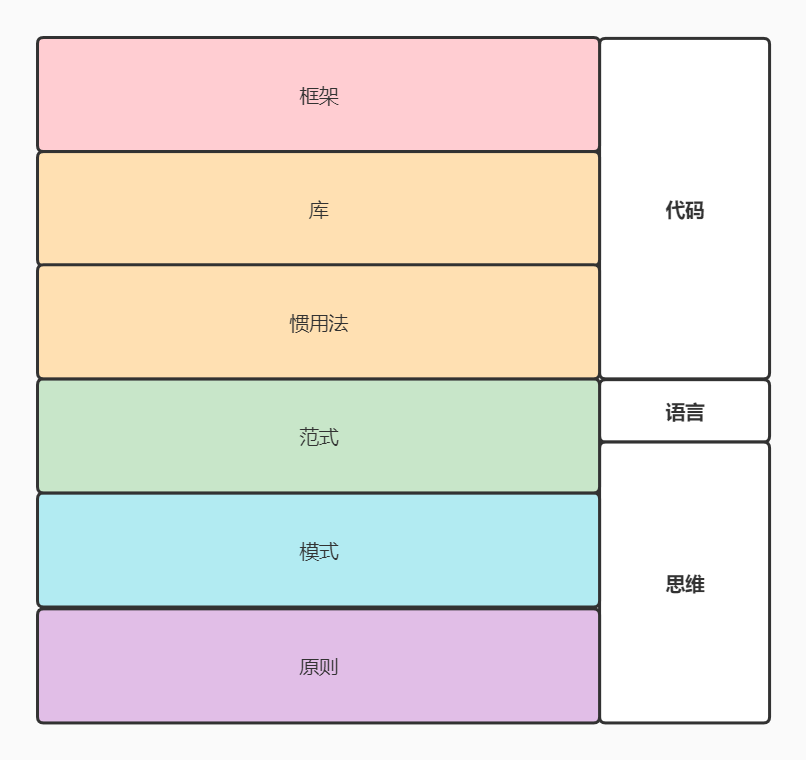

# 语言趋势

- 技术在进步，思想在轮回，感觉编程也像服装、发型一样，潮流几年一轮回。
- 编程语言会更加声明式，需要设法引入一些如元编程、函数编程的能力。并且让用户能够扩展语法，使他们可以构造特定领域语言。
- 你（coder）简单了，我（compiler）就复杂了。
- 语言混合或转换：
  - Eiffel
  - Forth
  - dart
  - typescript
  - [haxe](https://try.haxe.org/)
  - [onelang](https://ide.onelang.io/)
  - go+
  - Kotlin 
  - [gccxml](http://gccxml.github.io/HTML/Running.html)
  - [TransCoder](https://github.com/facebookresearch/TransCoder)
  - graalvm
  - webassembly

# 计算思维 vs 工程思维（编程、做饭、数学）

## 范式、原则、模式、库、框架
- 范式（paradigm）可查托马斯·库恩（Thomas Kuhn）在《科学革命的结构》(The Structure of Scientific Revolutions)中的论述。
他认为范式是一个共同体成员所共享的信仰、价值、技术等等的集合。 
- 1976 年，瑞士计算机科学家，Algol W，Modula，Oberon 和 Pascal 语言的设计师 Niklaus Emil Wirth写了一本非常经典的书《Algorithms + Data Structures = Programs》（链接为 1985 年版） ，即算法 + 数据结构 = 程序。
- 1979 年，英国逻辑学家和计算机科学家 Robert Kowalski 发表论文 Algorithm = Logic + Control，并且主要开发“逻辑编程”相关的工作。
任何算法都会有两个部分， 一个是 Logic 部分，这是用来解决实际问题的。另一个是 Control 部分，这是用来决定用什么策略来解决问题。Logic 部分是真正意义上的解决问题的算法，而 Control 部分只是影响解决这个问题的效率。程序运行的效率问题和程序的逻辑其实是没有关系的。我们认为，如果将 Logic 和 Control 部分有效地分开，那么代码就会变得更容易改进和维护。

- 凡是非命令式的编程都可归为声明式编程。因此，命令式、函数式和逻辑式是最核心的三种范式
- 命令式编程（Imperative）：详细的命令机器怎么（How）去处理一件事情以达到你想要的结果（What）
- 声明式编程（ Declarative）：只告诉你想要的结果（What），机器自己摸索过程（How）
- 函数式编程将计算描述为数学函数的求值
- 逻辑式编程通过提供一系列事实和规则来推导或论证结论
- 所有高级语言都建立于低级语言之上，最终转化为机器语言，声明式语言也不例外。
- 其次，声明式语言与命令式语言并非泾渭分明，而是互相交叉渗透的。一些‘非纯粹’ 的声明式语言也提供变量赋值和流程控制，而一些命令式语言也在逐渐发展，通过利用其他程序或增加新的语言特征来实现声明式编程
- 编程范式都是从写代码的人的角度来分的，从机器的角度就一种命令式
- 程序设计的核心是“数据和控制”--即“有什么菜，如何做”
- 编程范式/编程范式/程序设计法(Programming paradigm):是指从事软件工程的一类典型的编程风格（此概念好比“战略”）
- 程序设计模式:设计模式是软件设计中常见问题的典型解决方案(此概念好比“战术”)
- 编程范式体现编写程序的人如何看待程序设计的“世界观”；
- 程序设计模式则是解决一系列实际问题的“方法学”
- 声明式编程范式，偏向于你定义要什么，而不是怎么做。
- 命令式编程范式，偏向于怎么做，而不是要做什么。
- ‘算法+数据结构=程序’吧？这是Pascal设计者Niklaus Wirth的一本著作的书名，它刻画了过程式尤其是结构化编程的思想。后来Robert Kowalski进一步提出：算法=逻辑+控制。其中逻辑是算法的核心，控制主要用于改进算法的效率。在逻辑式编程中，程序员只需表达逻辑，而控制交给编程语言的解释器或编译器去管理。
- 编程范式的本质：有效地分离 Logic、Control 和 Data 是写出好程序的关键所在！
- Logic 部分才是真正有意义的（What）；Control 部分只是影响 Logic 部分的效率（How）

- 原则胜过模式，模式胜过库，库胜过框架

## 结构化方法（SA/SD/SP）
结构化方法是一种传统的软件开发方法，它是由结构化分析、结构化设计和结构化程序设计三部分有机组合而成的。它的基本思想：把一个复杂问题的求解过程分阶段进行，而且这种分解是自顶向下，逐层分解，使得每个阶段处理的问题都控制在人们容易理解和处理的范围内。

## 面向对象方法（OOA/OOD/OOP）
面向对象方法是基于对象概念,以对象为中心,以类和继承为构造机制,来认识,理解,刻画客观世界和设计,构建相应的软件系统的一门方法

