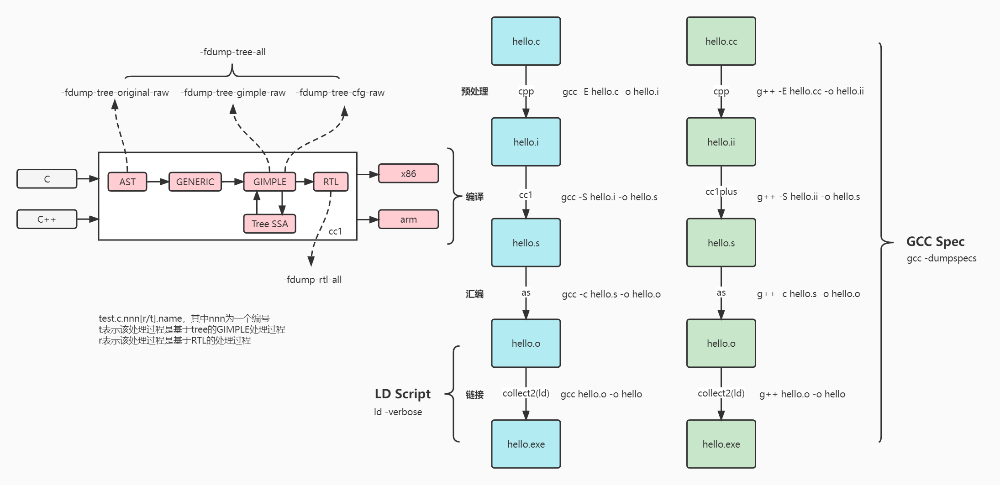
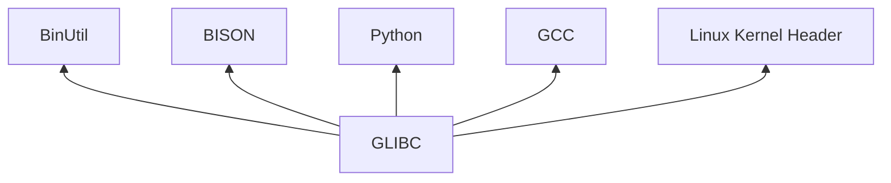
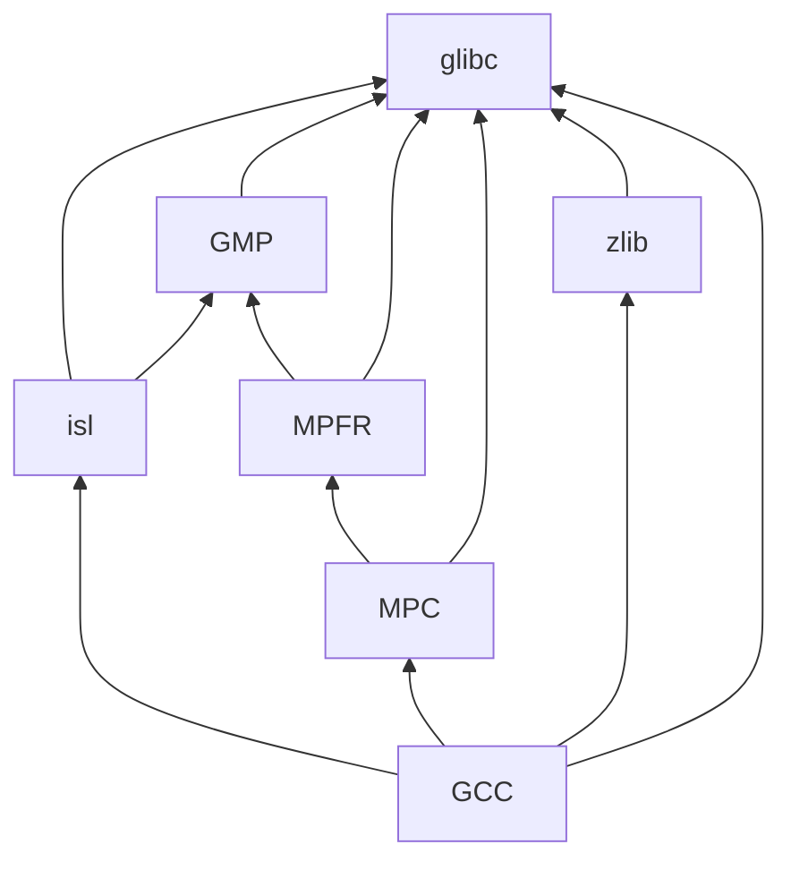
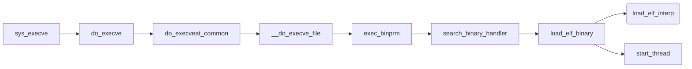
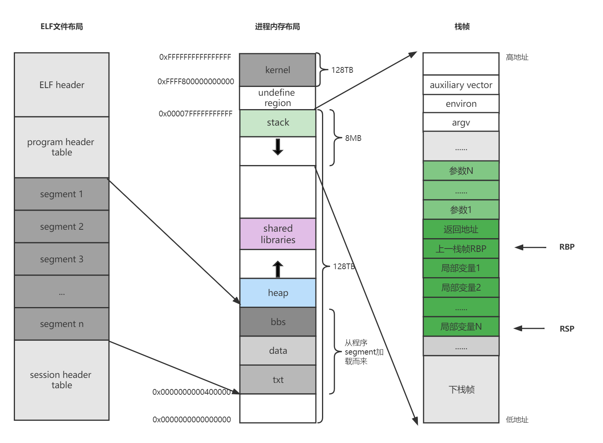
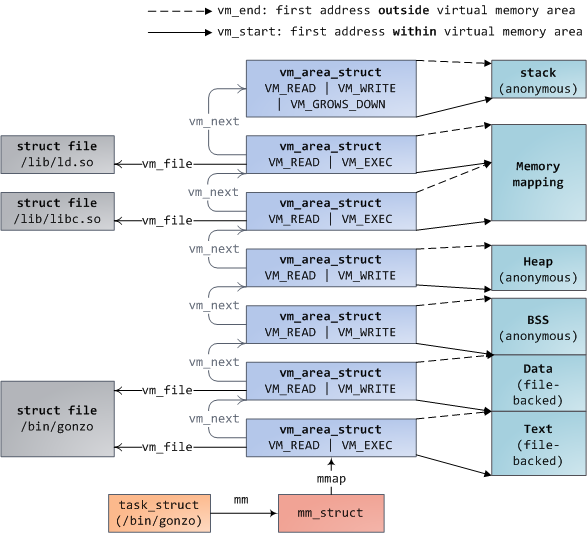
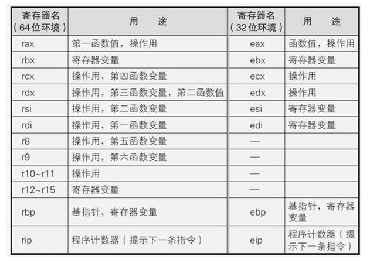
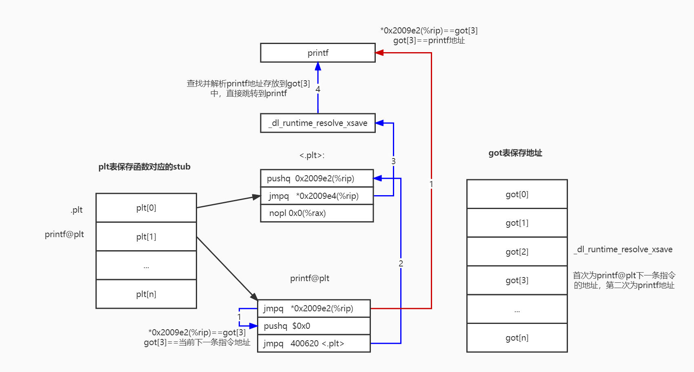

# 程序组成

- gcc 是一个驱动式的程序. 它调用其它程序来依次进行编译, 汇编和链接。GCC 分析命令行参数, 然后决定该调用哪一个子程序, 哪些参数应该传递给子程序。所有这些行为都是由 SPEC 字符串(spec strings)来控制的. 通常情况下, 每一个 GCC 可以调用的子程序都对应着一个 SPEC 字符串, 不过有少数的子程序需要多个 SPEC 字符串来控制他们的行为。spec strings控制crt1.o, crti.o, crtbegin.o, crtend.o, crtn.o 等目标文件和hello.o链接成一个执行文件。前面这5个目标文件的作用分别是启动、初始化、构造、析构和结束，它们通常会被自动链接到应用程序中。
  + asm          传递给汇编器的选项
  + asm_final    传递给汇编后处理器的选项
  + cpp          传递给 C 预处理器的选项
  + cc1          传递给 C 编译器的选项
  + cc1plus      传递给 C++ 编译器的选项
  + endfile      链接的最后需要包含的目标文件
  + link         传递给链接器的选项
  + lib          命令行传递给链接器的要包含的库
  + libgcc       决定给链接器传递哪个 GCC 支持库
  + linker       设置链接器的名字
  + predefines   传递给 C 预处理器的宏定义
  + signed_char  传递给 CPP 的用于说明 char 默认是否是有符号类型的宏
  + startfile    一开始就需要传递给链接器的目标文件
- ld script是ld提供的操作界面，用以对链接过程进行精确把控。使用ld linker script可以控制段的合并顺序、地址空间分配和链接符号导出。
  + .interp
  + .note.gnu.build-i
  + .note.ABI-tag
  + .gnu.hash
  + .dynsym
  + .dynstr
  + .gnu.version
  + .gnu.version_r
  + .rela.dyn
  + .rela.plt
  + .init
  + .plt
  + .plt.got
  + .plt.sec
  + .text
  + .fini
  + .rodata
  + .rodata1
  + .eh_frame_hdr
  + .eh_frame
  + .gcc_except_table
  + .tdata
  + .tbss
  + .preinit_array
  + .init_array
  + .fini_array
  + .ctors
  + .dtors
  + .jcr
  + .data.rel.ro 
  + .dynamic
  + .got
  + .data
  + .bss
  + .lbss
  + .lrodata
  + .ldata
  + .comment
  + .debug_aranges
  + .debug_info
  + .debug_abbrev
  + .debug_line
  + .debug_str
  + .symtab
  + .strtab
  + .shstrtab

- 可替换的标准c库，glibc、musl、uclibc、bionic、dietlibc、klibc、Newlib、eglibc
  + musl-gcc -static -Os hello.c -o hello
  + diet gcc -s -Os -pipe  hello.c -o hello
- 可替换的链接器，Gold、BDF、LLD、Mold
  + -fuse-ld=bfd
  + -fuse-ld=gold
  + -fuse-ld=lld
  + -fuse-ld=mold
- 可替换的动态链接器，--dynamic-linker=file


## GCC 辅助库
- libgcc_s编译器运行时(Compiler runtime)提供编译器隐式调用的函数的定义，以支持底层硬件不支持的操作(例如，128位整数乘法)，以及认为操作的内联展开不合适的地方。还提供了一系列_Unwind_*函数，实现了Itanium C++ ABI(第I级)的语言无关的堆栈unwind部分。
- libatomic原子库(Atomics library)提供程序使用的原子操作，编译器无法直接降低他们到机器指令（因为没有合适的机器指令或操作数不知道适当对齐），将会生成对一个运行时库__atomic_*函数的一次调用。这些程序需要一个包含这些原子函数的运行时库。
- Sanitizer 运行时以维持程序执行的侧面状态，并在发现问题时发出诊断信息。
- libsupc++是 GCC 对Itanium C++ ABI规范的实现。但是，只有在静态链接libstdc++时才使用这个库。libstdc++的动态库版本包含libsupc++的一个副本。

- gcc *.a
```
libasan.a
libatomic.a
libbacktrace.a
libgcc.a
libgcc_eh.a
libgcov.a
libgomp.a
libitm.a
liblsan.a
libquadmath.a
libssp_nonshared.a
libstdc++.a
libstdc++fs.a
libsupc++.a
libtsan.a
libubsan.a
```

- gcc *.so
```
libasan.so
libatomic.so
libcc1.so
libgcc_s.so
libgomp.so
libitm.so
liblsan.so
liblto_plugin.so
libquadmath.so
libstdc++.so
libtsan.so
libubsan.so 
```

- gcc *.o
```
crtbegin.o
crtbeginS.o
crtbeginT.o
crtend.o
crtendS.o
crtfastmath.o
crtoffloadbegin.o
crtoffloadend.o
crtoffloadtable.o
crtprec32.o
crtprec64.o
crtprec80.o
libasan_preinit.o
liblsan_preinit.o
```
## Glibc辅助库
glibc *.o
```
Mcrt1.o
Scrt1.o
crt1.o
crti.o
crtn.o
gcrt1.o
grcrt1.o
libtsan_preinit.o
rcrt1.o
```

glibc *.so
glibc *.a

```
ld-2.21.so：用于动态库执行的辅助程序
libBrokenLocale.{a,so}：Glibc 内部的一个粗暴破解用来修复损坏程序（比如，一些 Motif 应用）。查看文件 glibc-2.21/locale/broken_cur_max.c 里的注释来了解更多信息
libSegFault.so：段错误信号处理函数，catchsegv会用到
libanl.{a,so}：一个异步名字查找库
libc.{a,so}：主要的 C 库
libc_nonshared.a
libcidn.so：Glibc 内部用于在函数 getaddrinfo() 中处理国际化域名
libcrypt.{a,so}：密码学函数库
libdl.{a,so}：动态链接接口函数库
libg.a：不包含函数的一个空库。以前是 g++ 的运行时库
libieee.a：链接该模块会强制使用电气与电子工程师协会（IEEE) 定义的数学函数错误处理规则。默认的是 POSIX.1 错误处理。
libm.{a,so}：数学运算函数库
libmcheck.a：链接这个库后会打开内存分配检查
libmemusage.so：memusage 命令用它来协助收集应用程序里内存使用信息
libnsl.{a,so}：网络服务函数库
libnss.so：名称服务切换函数库，包含了解析主机名、用户名、组名、别称、服务、协议等等的函数。
libpcprofile.so：包含一些分析函数，用于跟踪特定源代码里的 CPU 时间占用情况
libpthread.{a,so}：POSIX 线程函数库
libresolv.{a,so}：包含了创建、发送和解析互联网域名服务器封包的函数
librpcsvc.a：包含了提供杂项 RPC 服务的函数
librt.{a,so}：包含了实现 POSIX.1b 实时扩展里规定的大部分接口的函数
libthread_db.so：包含了方便构建多线程程序调试工具的函数
libutil.{a,so}：包含各种 Unix 应用程序中用到的“标准” 函数的代码
```
## 依赖关系
- GLIBC对BinUtil、BISON、Python、GCC、linux kernel header有依赖
使用高版本内核头文件编译的Glibc二进制文件完全可以运行在较低版本的内核上，并且当你升级内核后新内核的特性仍然可以得到充分发挥而无需重新编译Glibc。但是如果编译时使用的头文件的版本较低，那么运行在更高版本的内核上时，新内核的特性就不能得到充分发挥。

- GCC依赖
  - GMP：GNU多精度算术库
  - MPFR：GNU多精度浮点舍入库
  - MPC：GNU多精度C库
  - isl：是Integer Set Library的简写，是一款操作集和线性约束范围内整数点关系的库。支持的操作集包括：交集、并集、差集、空虚检查，凸壳、仿射包（整数）、整数投影，以及使用参数整数规划进行最小限度的字典计算。它还包括一个整数的规划求解基于广义的基础。


# 程序运行
## 内核态部分

- 如果需要装入解释器，那么使用解释器映像的入口地址。这样返回用户空间时先执行解析器程序。
- 若不需要装入解释器，那么这个入口地址就使用映像本身的入口地址。


## 用户态部分


**动态链接器**
- 动态链接器的自举
- 装载依赖共享库
- 重定位与初始化

## 测试程序
initfini.c
```c
#include <stdio.h>
#include <stdlib.h>
#include <sys/auxv.h>


//gcc -g -o initfini initfini.c -ladd -L. -Wl,-rpath=.

void preinit(int argc, char **argv, char **envp) {
 printf("%s\n", __FUNCTION__);
}

void init(int argc, char **argv, char **envp) {
 printf("%s\n", __FUNCTION__);
}

void fini() {
 printf("%s\n", __FUNCTION__);
}

__attribute__((section(".init_array"))) typeof(init) *__init = init;
__attribute__((section(".preinit_array"))) typeof(preinit) *__preinit = preinit;
__attribute__((section(".fini_array"))) typeof(fini) *__fini = fini;

void  __attribute__ ((constructor(101))) constructor101() {
 printf("%s\n", __FUNCTION__);
}
void  __attribute__ ((constructor(102))) constructor102() {
 printf("%s\n", __FUNCTION__);
}
void __attribute__ ((destructor(101))) destructor101() {
 printf("%s\n", __FUNCTION__);
}
void __attribute__ ((destructor(102))) destructor102() {
 printf("%s\n", __FUNCTION__);
}
void my_atexit1() {
 printf("%s\n", __FUNCTION__);
}

void my_atexit2() {
 printf("%s\n", __FUNCTION__);
}
int lib_add(int a, int b);

int main(int argc, char **argv, char **envp) {
    printf("%d\n", lib_add(1, 2));

    atexit(my_atexit1);
    atexit(my_atexit2);
    printf("main return\n");
    return 0;
}
```
add.c
```c
#include <stdio.h>
#include <stdlib.h>
//gcc -g -shared -fPIC add.c -o libadd.so
int lib_var = 42;
int lib_add(int a, int b) {
    return a + b;
}
void lib_atexit1();
void lib_atexit2();

void lib_init() {
    printf("lib %s\n", __FUNCTION__);
    atexit(lib_atexit1);
    atexit(lib_atexit2);
}

void lib_fini() {
    printf("lib %s\n", __FUNCTION__);
}

// .preinit_array section is not allowed in DSO
__attribute__((section(".init_array"))) typeof(lib_init) *__init = lib_init;
__attribute__((section(".fini_array"))) typeof(lib_fini) *__fini = lib_fini;

void  __attribute__ ((constructor(101))) lib_constructor101() {
    printf("lib %s\n", __FUNCTION__);
}
void  __attribute__ ((constructor(102))) lib_constructor102() {
    printf("lib %s\n", __FUNCTION__);
}
void __attribute__ ((destructor(101))) lib_destructor101() {
    printf("lib %s\n", __FUNCTION__);
}
void __attribute__ ((destructor(102))) lib_destructor102() {
    printf("lib %s\n", __FUNCTION__);
}
void lib_atexit1() {
    printf("lib %s\n", __FUNCTION__);
}

void lib_atexit2() {
    printf("lib %s\n", __FUNCTION__);
}

```
**运行结果：**
```
$ ./initfini
preinit
lib lib_constructor101
lib lib_constructor102
lib lib_init                           # ld-linux.so里
constructor101
constructor102
init
3
main return
my_atexit2
my_atexit1
fini
destructor102
destructor101
lib lib_fini
lib lib_atexit2
lib lib_atexit1
lib lib_destructor102
lib lib_destructor101
```
# 内存布局


```
cat /proc/pid/maps
```


**Linux x64和x86相比，主要区别在于参数的传递上：**
- x86使用栈传递全部参数。GCC默认将函数参数从右至左push到栈中。由函数调用方负责平衡栈。
- x64优先使用寄存器传递参数。对于前6个参数，分别使用rdi, rsi, rdx, rcx, r8, r9传递参数。参数超过6个时使用栈传递额外的参数。同样由调用方平衡栈。
- 二者都使用eax/rax存储函数返回值。
# 延迟绑定


```
readelf -r hello.o
readelf -r hello
objdump -d -s -j .plt -j .got.plt hello
```
- **重定位**是连接符号引用与符号定义的过程（符号和地址的绑定）
- **.rel.text**（链接时重定位）
重定位的地方在.text段内，以offset指定具体要定位位置。在连接时候由连接器完成。注意比较.text段前后变化。指的是比较.o文件和最终的执行文件（或者动态库文件）。就是重定位前后比较，以上是说明了具体比较对象而已。
- **.rel.dyn**（启动时重定位）
重定位的地方在.got段内。主要是针对外部数据变量符号。例如全局数据。重定位在程序运行时定位，一般是在.init段内。定位过程：获得符号对应value后，根据rel.dyn表中对应的offset，修改.got表对应位置的value。另外，.rel.dyn 含义是指和dyn有关，一般是指在程序运行时候，动态加载。区别于rel.plt，rel.plt是指和plt相关，具体是指在某个函数被调用时候加载。
- **.rel.plt**（调用时重定位）
重定位的地方在.got.plt段内（注意也是.got内,具体区分而已）。 主要是针对外部函数符号。一般是函数首次被调用时候重定位。可看汇编，理解其首次访问是如何重定位的，实际很简单，就是初次重定位函数地址，然后把最终函数地址放到.got.plt内，以后读取该.got.plt就直接得到最终函数地址(参考过程说明)。  所有外部函数调用都是经过一个对应桩函数，这些桩函数都在.plt段内。
- **.got**（Global Offset Table，全局偏移表）
是Linux ELF文件中用于定位全局变量和函数的一个表。GOT表前三项是特殊的：GOT[0]本ELF动态段(.dynamic段)的装载地址;GOT[1]本ELF的link_map数据结构描述符地址（编译时填充0）;GOT[2]_dl_runtime_resolve函数的地址（编译时填充0）。GOT的其他表项为全局变量的地址或者为不需要延迟绑定的函数的地址。
- **.got.plt** 用于存放需要延迟绑定的函数的地址
- **.plt（延迟绑定）**（Procedure Linkage Table，过程链接表）
是Linux ELF文件中用于延迟绑定的表，即函数第一次被调用的时候才进行绑定。因此，第一次调用函数时开销比较大，但是其后的每次调用都只会花费一条指令和一个间接的存储器引用。其中PLT[0]是一个特殊的表项，它跳转到动态链接器中执行。.plt 关联 GOT 项是在 .rela.plt中。
- **.plt.got（立即绑定）** 非延迟绑定的plt。.plt.got 关联 GOT 项是在 .rela.dyn。
- **.plt.sec** 启用-fcf-protection编译选项时，原先属于.plt的现在属于.plt.sec。
 

