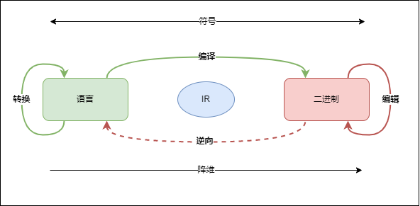

# 主题
- [编译](compile.md)
- [程序](program.md)
- [打桩](stub.md)
- [语言](language.md)
- [工具](bin.md)

# 案例
- [交易系统API SafeEngine和openssl1.1.1符号冲突](symbolic.md)
- [Linux高版本编译的程序在低版本上运行，依赖高版本glibc符号](abi.md)
- 六期itas向交易系统注入动态库，支持查询内存数据
- 信创并行编译问题，导致TE程序运行异常
- 出入金低版本预编译库在高版本编译运行异常
- [交易系统升级红帽8 libstdc++ 库中的 std::string 和 std::list 类的应用程序二进制接口(ABI)在 RHEL 7(GCC 4.8)和 RHEL 8(GCC 8)之间有所改变，以符合 C++11 标准](https://gcc.gnu.org/onlinedocs/gcc-5.2.0/libstdc++/manual/manual/using_dual_abi.html)
- GCC -O2时对一个函数符号产生了两个符号一个全局一个局部符号，导致stub时失败。通过加上-fno-inline解决
- 仿真红帽6.6的服务器上编译aicp程序，报错找不到符号，原因是升级libm，但没有升级libc

# 扩展
- [Code Models](https://alittleresearcher.blogspot.com/2017/03/understanding-the-x64-code-models.html)
    - -mcmodel=small
    - -mcmodel=kernel
    - -mcmodel=medium
    - -mcmodel=large
- [Data Models](https://en.wikipedia.org/wiki/64-bit_computing#64-bit_data_models)

|  Data Model | short | int | long | long long | pointer|
| --- | --- | --- |--- | --- | --- |
| LLP64 | 16 | 32| 32| 64 | 64|
| LP64 | 16 | 32| 64| 64 | 64|
| ILP32 | 16 | 32| 32| 64 | 32|
| ILP64 | 16 | 64| 64| 64 | 64|

- [Memory Models](https://colobu.com/2021/06/30/hwmm/)

|  内存乱序行为|    x86 |      arm |
| --- | --- | --- |
| 读-读乱序 |             不允许 |  允许 |
| 读-写乱序  |            不允许  | 允许 |
| 写-读乱序   |           允许 |   允许 |
| 写-写乱序    |          不允许|  允许 |
| 原子操作-读写乱序 |      不允许 | 允许 |

- [API/ABI changes review for glibc](https://abi-laboratory.pro/?view=timeline&l=glibc)
- [Linux and glibc API changes](https://man7.org/tlpi/api_changes/)
- [Linux Foundation Referenced Specifications](https://refspecs.linuxfoundation.org/)
- [GCC doc](https://gcc.gnu.org/onlinedocs/gcc/Option-Summary.html#Option-Summary)
